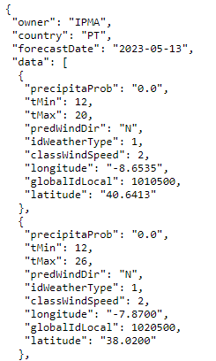
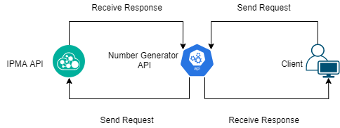
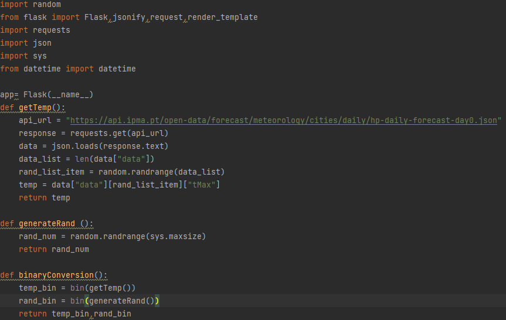
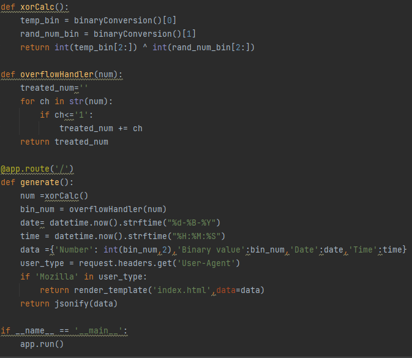
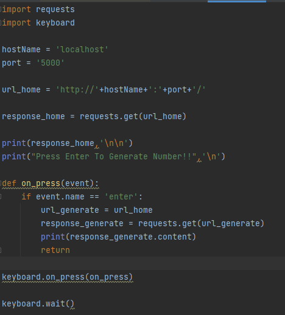
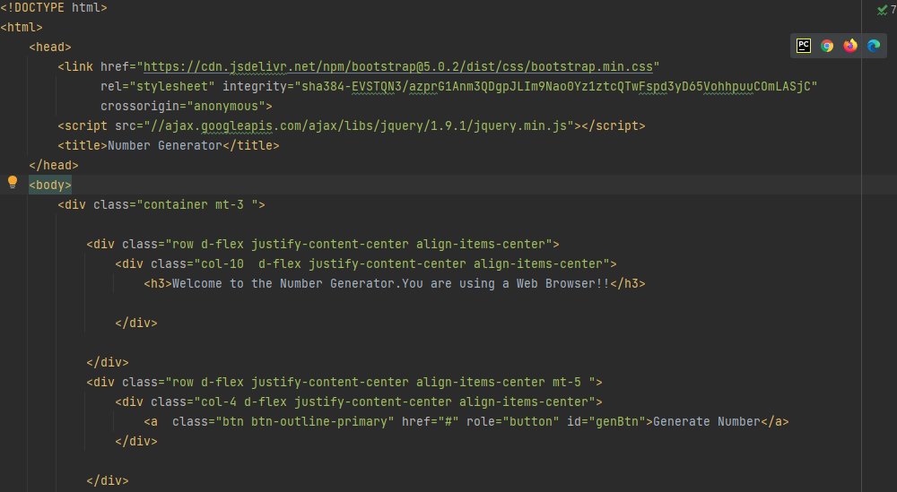
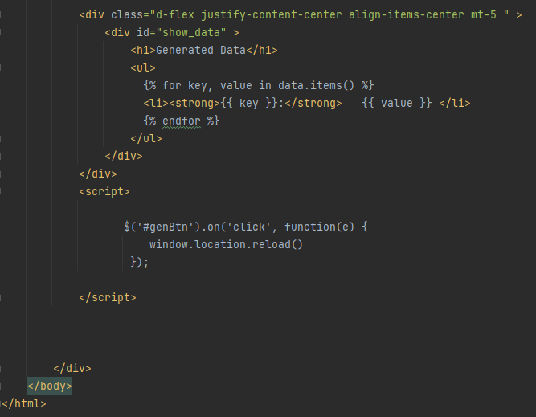
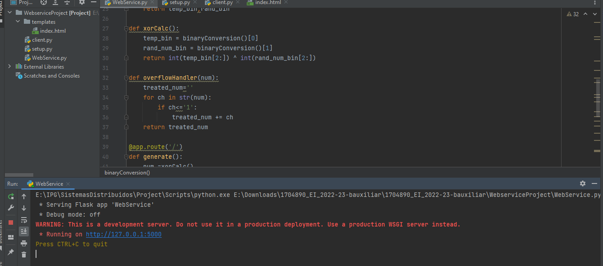
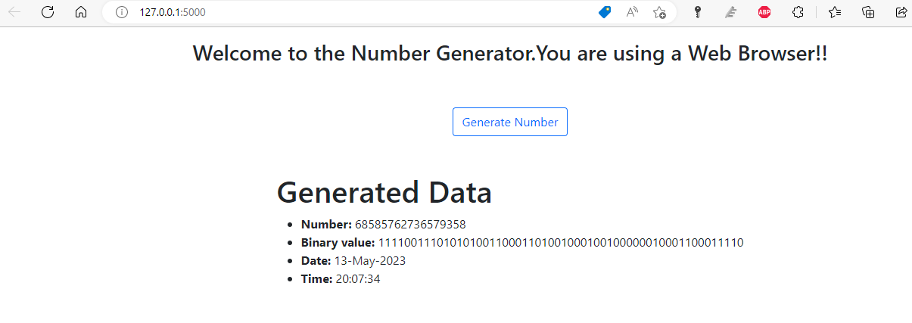
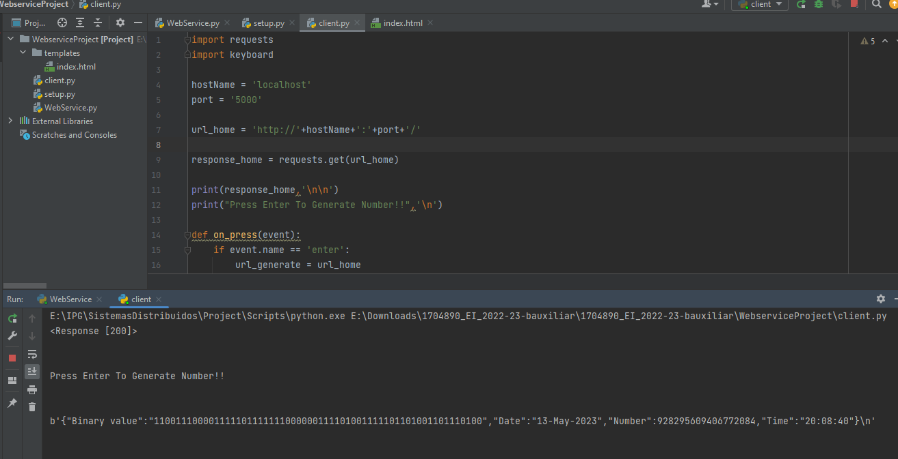

# 1704890_EI_2022-23

Paulo Proença 1704890

## Relatório do Trabalho prático
## Sistemas Distribuídos

<nome do trabalho>

Aluno: Paulo Proença, 1704890, 
       PJProenca, paulojorgeproenca@gmail.com

#### 1. Descrição do Trabalho
// breve descrição do que consiste o trabalho

#### 2.Imprementação do Trabalho	
  
### 2.1 Algoritmo
  Para este projeto foi elaborado um algoritmo que faz uso de dois numeros sobre os quais irá ser efetuadas algumas operações de onde resultará o nosso número aleatório, sendo este o seguinte:

	cliente FAZ REQUEST ao server
	server FAZ REQUEST a uma api externa
	server RECEBE RESPONSE dessa api externa	
	server GERA numero usando função RANDOM
	CONVERTE ambos os numeros para binário
	efetua uma operação XOR sobre os dois valores
EFETUA uma operação para tratar overflow
Cliente RECEBE RESPONSE do server
### 2.2 Modelo de dados

O modelo de dados utilizado neste projeto é o JSON. Este modelo é utilzado pela API do IPMA (IPMA, n.d.), tendo o seguinte formato:

### 2.3 Arquitetura cliente - servidor
De seguida temos um diagrama que representa a aquitetura cliente-servidor que será immplemetada neste projeto.

### 2.4 Implementação

Para implementação deste projeto foi utilizada a Linguagem Python, seguindo-se o código criado para efetuar essa implementação bem como uma demonstração da sua execução, (Vieira, n.d.).

## 2.4.1 Código do servidor

## 2.4.2 Codigo do Cliente

#### 2.4.3 Codigo Front-End

#### 3.Funcionamento do trabalho	

Foi utilizada neste projeto a framework Flask (Ronacher, n.d.) que contém alguns métodos que simplificam a eleboração do projeto. Foi decidido que a API externa que vamos utilizar é a do IPMA que contém um objeto JSON no qual existe uma KEY com uma lista de JSON. Após a recepção desse objecto JSON o server vai ,de forma pseudoaleatória,escolher um indice dessa lista de onte irá extrair o valor da key tMax. Depois de extraido esse valor será convertido em binário. Entretanto é tambem gerando um número pseudoaleatório usando a função Random do Python, que será tambem ele convertido em notação binária. De seguida será efetuada a operação XOR aos dois valores binários. Para evitar overflow o resultado tem quer tratado. Após verificar que o Python em caso de overflow com numeros binários devolve valores diferentes de 1 e 0, foi criada uma função que elimina todos os valores diferentes de 0 ou 1. O API vai também efetuar uma verificação de modo a distinguir que tipo cliente é o cliente que está a fazer o Request, Browser ou nao (Stack Overflow), n.d.)Caso seja um Browser o valor seré  renderizado para uma pagina HTML e os dados mostrados de acordo com isso.
Caso nao seja Browser os dados enviados serão em formato JSON.

### 3.1 Servidor em execução

### 3.2 Cliente em execução - Browser

## 3.3 Cliente em execução

#### 4.Conclusão

Neste projeto o objetivo era criar um API que gera-se números pseudoaleatórios, introduzindo alguma aleatoriedade no processo. Foi entao usado de forma a gerar alguma incerteza o valor da temperatura de um determinado local em Portugal,sendo esse valor adquirido através do IPMA. Esse valor juntamente com um outro gerado utilizando uma funçao Random foram utilizados na geração desse numero que é devolvido em conformidado ao cliente. O algoritmo é bastante simples e poderia ter sido criado um algoritmo um pouco mais complexo, mas ainda assim acredito que o projecto está de acordo com o que se pretendia. 

#### Bibliografia

IPMA. (n.d.). ″. ″ - Wiktionary. Retrieved May 13, 2023, from https://api.ipma.pt/open-data/forecast/meteorology/cities/daily/hp-daily-forecast-day0.json
Ronacher, A. (n.d.). Welcome to Flask — Flask Documentation (2.3.x). Retrieved May 13, 2023, from https://flask.palletsprojects.com/en/2.3.x/
Stack Overflow. (n.d.). How do I get the user agent with Flask? Stack Overflow. Retrieved May 13, 2023, from https://stackoverflow.com/questions/9878020/how-do-i-get-the-user-agent-with-flask
Vieira, P. (n.d.). Apontamentos do Docente.